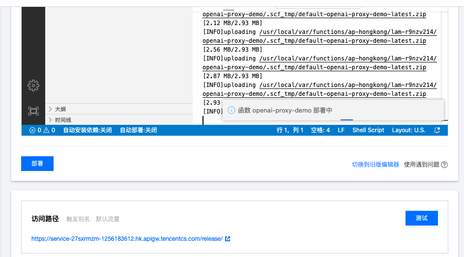

# 此Proxy可以部署到腾讯云函数

① 进入[云函数创建面板](https://console.cloud.tencent.com/scf/list-create?rid=5&ns=default&createType=empty)，选择中国香港、web函数、NodeJS 16。


② 在函数代码处点击`app.js`将本项目 [app.js](/app.js) 的代码粘贴进去。


其他不用改，点创建。

③ 创建完成后，点击「函数管理」→「函数代码」。等编辑器把函数代码加载完成后 CloudStudio → 终端 → 新终端，打开一个新终端。


④ 在出现的终端中粘贴以下代码 

```bash
cd src && yarn add body-parser@1.20.2 cross-fetch@3.1.5 eventsource-parser@0.1.0 express@4.18.2 multer@1.4.5-lts.1
```


⑤ 点编辑器右上角的「部署」，等待部署完成。


⑥ 在触发管理中，选择创建触发器；版本选择 $LATEST，然后提交；创建完成后，访问路径就是该函数的公网路径；
使用时将 `https://api.openai.com/` 替换为该路径即可，如 `https://api.openai.com/v1/chat/completions` 替换为 `https://xxxxx.apigw.tencentcs.com/release/v1/chat/completions`



⑦ 调整函数执行超时时间，默认的3s会经常超时，建议调整为10s以上的时间
