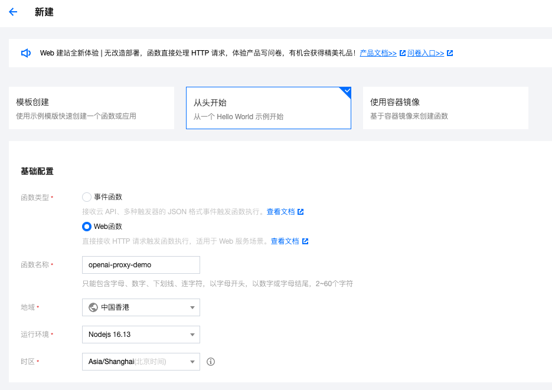
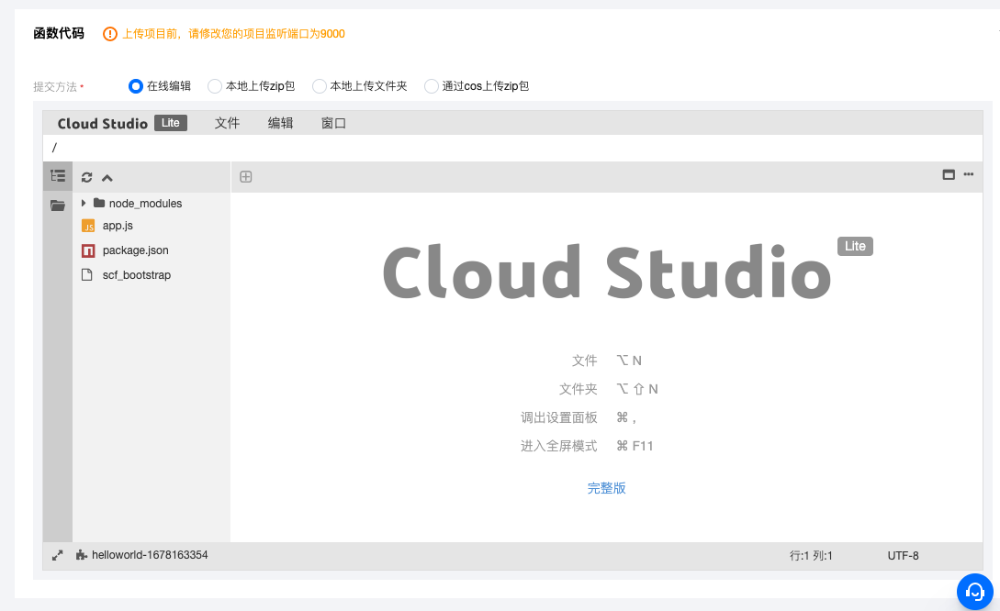
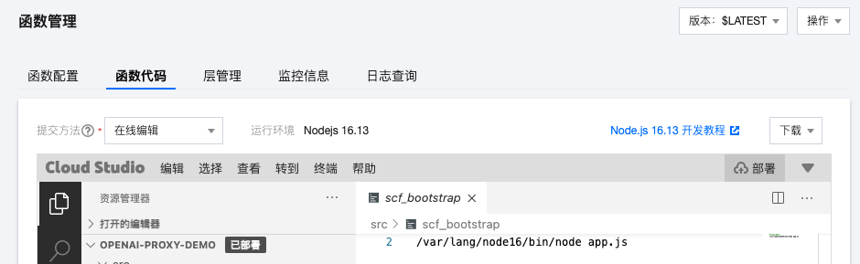
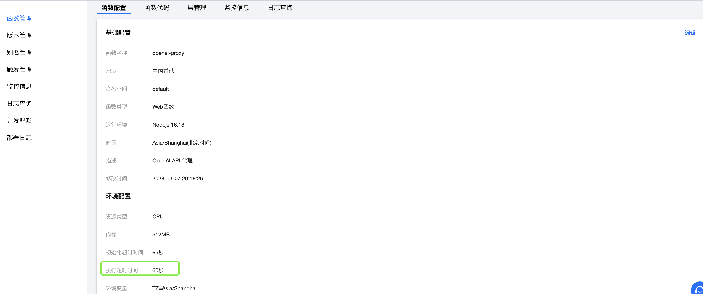

# 此Proxy可以部署到腾讯云函数

> ⚠️ 由于腾讯云自身规则，虽然代码本身支持SSE，但部署为云函数后可能无法正常工作

① 进入[云函数创建面板](https://console.cloud.tencent.com/scf/list-create?rid=5&ns=default&createType=empty)，选择日本/新加坡(有issue反馈因为unsupported location被封号，虽然无法完全确定原因，但建议不再使用~~中国香港~~)、web函数、NodeJS 16。



② 在函数代码处点击`app.js`将本项目 [app.js](/app.js) 的代码粘贴进去。



其他不用改，点创建。

③ 创建完成后，点击「函数管理」→「函数代码」。等编辑器把函数代码加载完成后 CloudStudio → 终端 → 新终端，打开一个新终端。


④ 在出现的终端中粘贴以下代码 

```bash
cd src && yarn add body-parser@1.20.2 cross-fetch@3.1.5 eventsource-parser@0.1.0 express@4.18.2 multer@1.4.5-lts.1
```


⑤ 点编辑器右上角的「部署」，等待部署完成。



⑥ 下拉或者进入「触发管理」可以看到云函数的访问地址。


⑦ 调整函数执行超时时间，默认的3s会经常超时，建议调整为30s；同时添加环境变量 `TIMEOUT`(单位为毫秒，如30000)


⑧ 如果你想绑定自己的域名，需要在「触发管理」中开启「标准API网关」，按腾讯云教程进行配置。

## Proxy的使用

使用时将 `https://api.openai.com/` 替换为该路径即可，如 `https://api.openai.com/v1/chat/completions` 替换为 `https://xxxxx.apigw.tencentcs.com/release/v1/chat/completions`

